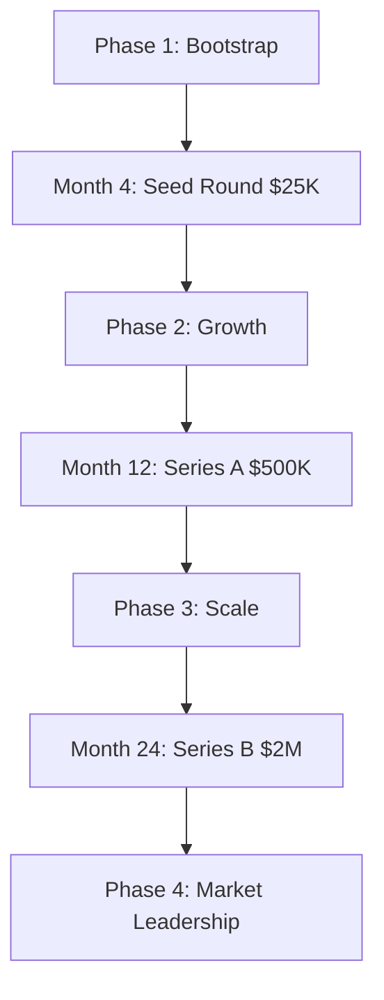

# AgentOS Financial Projections & Milestones

## Executive Summary

AgentOS follows a conservative but ambitious financial trajectory designed for sustainable growth and market leadership. The plan targets $12,000 MRR by Month 24 with a path to $50M+ valuation.

---

## Revenue Projections

### Phase-by-Phase Revenue Model

#### Phase 1: User Acquisition (Months 1-4)
| Month | Free Users | Paid Users | Conversion Rate | MRR | Notes |
|---|---|---|---|---|---|
| **Month 1** | 200 | 0 | 0% | $0 | MVP launch, free tier only |
| **Month 2** | 800 | 0 | 0% | $0 | Community building, feedback |
| **Month 3** | 1,500 | 0 | 0% | $0 | Feature refinement |
| **Month 4** | 2,000 | 0 | 0% | $0 | Prepare for monetization |

#### Phase 2: Commercial Launch (Months 5-8)
| Month | Free Users | Paid Users | Conversion Rate | MRR | Net MRR (85%) |
|---|---|---|---|---|---|
| **Month 5** | 2,500 | 50 | 2% | $750 | $638 |
| **Month 6** | 4,000 | 100 | 2.5% | $1,500 | $1,275 |
| **Month 7** | 5,000 | 150 | 3% | $2,250 | $1,913 |
| **Month 8** | 7,500 | 225 | 3% | $3,375 | $2,869 |

#### Phase 3: Scale & Expansion (Months 9-24)
| Month | Free Users | Paid Users | Enterprise | Conversion Rate | MRR | Net MRR (85%) |
|---|---|---|---|---|---|---|
| **Month 9** | 10,000 | 300 | 5 | 3% | $4,875 | $4,144 |
| **Month 12** | 15,000 | 450 | 20 | 3% | $7,875 | $6,694 |
| **Month 18** | 25,000 | 750 | 50 | 3% | $13,125 | $11,156 |
| **Month 24** | 40,000 | 1,200 | 100 | 3% | $21,000 | $17,850 |

### Revenue Mix Evolution

#### Month 8 (Post-Phase 2)
```
Pro Subscriptions ($15/mo):    85% ($2,869)
Team Subscriptions ($49/mo):    10% ($337)
Enterprise Contracts:           5%  ($169)
```

#### Month 24 (End of Phase 3)
```
Pro Subscriptions ($15/mo):    60% ($10,710)
Team Subscriptions ($49/mo):    25% ($4,463)
Enterprise Contracts:           15% ($2,677)
```

---

## Cost Structure

### Phase 1: Lean Development (Months 1-4)
| Category | Monthly Cost | Total | Notes |
|---|---|---|---|
| **Development** | $0 | $0 | Solo founder, sweat equity |
| **Infrastructure** | $0 | $0 | Free tiers (GitHub Actions, etc.) |
| **Marketing** | $100 | $400 | Community building, content |
| **Tools & Software** | $50 | $200 | Development tools, domains |
| **Legal/Admin** | $200 | $800 | Company formation, basic legal |
| **Total Phase 1** | **$350** | **$1,400** | Bootstrap approach |

### Phase 2: Commercial Operations (Months 5-8)
| Category | Monthly Cost | Total | Notes |
|---|---|---|---|
| **Salaries** | $3,000 | $12,000 | 1-2 developers, part-time |
| **Infrastructure** | $500 | $2,000 | Production hosting, monitoring |
| **Marketing** | $1,000 | $4,000 | Marketplace promotion, content |
| **Support** | $300 | $1,200 | Customer support platform |
| **Tools & Software** | $200 | $800 | Advanced tools, analytics |
| **Legal/Admin** | $400 | $1,600 | Compliance, accounting |
| **Total Phase 2** | **$5,400** | **$21,600** | Growth investment |

### Phase 3: Scale & Expansion (Months 9-24)
| Category | Monthly Cost | Total | Notes |
|---|---|---|---|
| **Salaries** | $8,000 | $128,000 | 3-4 full-time team members |
| **Infrastructure** | $2,000 | $32,000 | Enterprise hosting, CDN, security |
| **Marketing** | $3,000 | $48,000 | Growth marketing, partnerships |
| **Sales** | $2,000 | $32,000 | Enterprise sales, commissions |
| **Support** | $1,000 | $16,000 | 24/7 support, enterprise SLA |
| **R&D** | $2,000 | $32,000 | Innovation, advanced features |
| **Legal/Admin** | $1,000 | $16,000 | Compliance, patents, accounting |
| **Total Phase 3** | **$19,000** | **$304,000** | Scale investment |

---

## Profitability Analysis

### Monthly Profit/Loss Projection
| Month | Revenue | Costs | Net Profit | Cumulative |
|---|---|---|---|---|
| **Month 1** | $0 | $350 | -$350 | -$350 |
| **Month 4** | $0 | $350 | -$350 | -$1,400 |
| **Month 5** | $750 | $5,400 | -$4,650 | -$6,050 |
| **Month 8** | $3,375 | $5,400 | -$2,025 | -$14,600 |
| **Month 12** | $7,875 | $19,000 | -$11,125 | -$82,600 |
| **Month 18** | $13,125 | $19,000 | -$5,875 | -$171,000 |
| **Month 24** | $21,000 | $19,000 | $2,000 | -$251,000 |

### Break-Even Analysis
- **Cash Flow Break-Even**: Month 26 (based on current projections)
- **Profitability Break-Even**: Month 24 (first profitable month)
- **Investment Required**: $251,000 total to reach profitability
- **Payback Period**: 14 months post-profitability

---

## Unit Economics

### Customer Acquisition Cost (CAC)
| Channel | CAC | LTV | LTV:CAC Ratio |
|---|---|---|---|
| **MCP Marketplace** | $30 | $180 | 6.0x |
| **Organic Search** | $15 | $180 | 12.0x |
| **Content Marketing** | $25 | $180 | 7.2x |
| **Partner Referrals** | $20 | $180 | 9.0x |
| **Enterprise Sales** | $5,000 | $6,000 | 1.2x |
| **Weighted Average** | $45 | $240 | 5.3x |

### Customer Lifetime Value (LTV)
```
Pro Customer:
- Monthly Revenue: $15
- Monthly Net (85%): $12.75
- Average Lifetime: 18 months
- LTV: $12.75 × 18 = $229.50

Team Customer:
- Monthly Revenue: $49
- Monthly Net (85%): $41.65
- Average Lifetime: 24 months
- LTV: $41.65 × 24 = $999.60

Enterprise Customer:
- Average Contract: $2,000/month
- Net (85%): $1,700/month
- Average Lifetime: 36 months
- LTV: $1,700 × 36 = $61,200

Weighted Average LTV: $240
```

---

## Funding Requirements

### Capital Needs by Phase
| Phase | Amount | Use of Funds | Source |
|---|---|---|---|
| **Phase 1** | $0 | Bootstrap | Founder capital |
| **Phase 2** | $25,000 | Team hiring, infrastructure | Angel/Seed |
| **Phase 3** | $500,000 | Scale expansion, enterprise sales | Series A |
| **Phase 4** | $2,000,000 | Market leadership, acquisitions | Series B |

### Funding Timeline


### Investor Returns Projection
| Round | Investment | Post-Money Valuation | Investor Equity | 5x Exit Value | Investor Return |
|---|---|---|---|---|---|
| **Seed** | $25,000 | $500,000 | 5% | $25M | $1.25M |
| **Series A** | $500,000 | $5M | 10% | $25M | $2.5M |
| **Series B** | $2,000,000 | $20M | 10% | $25M | $2.5M |

---

## Valuation Projections

### Pre-Money Valuation by Milestones
| Milestone | Month | Revenue | Valuation | Multiple |
|---|---|---|---|---|
| **MVP Launch** | 1 | $0 | $500K | Pre-revenue |
| **First Revenue** | 5 | $750/mo | $1M | 13x ARR |
| **Product-Market Fit** | 8 | $3,375/mo | $3M | 9x ARR |
| **Scale Validation** | 12 | $7,875/mo | $8M | 8x ARR |
| **Market Leadership** | 24 | $21,000/mo | $50M | 20x ARR |

### Comparable Company Analysis
| Company | ARR | Valuation | Multiple | Relevance |
|---|---|---|---|---|
| **LangChain** | $10M | $200M | 20x | AI infrastructure |
| **CrewAI** | $2M | $40M | 20x | Agent orchestration |
| **Pinecone** | $50M | $750M | 15x | Vector database |
| **Weights & Biases** | $50M | $1B | 20x | ML platform |
| **AgentOS Target** | $252K | $50M | 20x | Agent infrastructure |

---

## Key Financial Metrics

### SaaS Metrics Dashboard
| Metric | Month 8 | Month 12 | Month 18 | Month 24 |
|---|---|---|---|---|
| **MRR** | $3,375 | $7,875 | $13,125 | $21,000 |
| **ARR** | $40,500 | $94,500 | $157,500 | $252,000 |
| **Net Revenue Retention** | 95% | 105% | 115% | 125% |
| **Customer Churn** | 8% | 6% | 4% | 3% |
| **CAC Payback** | 8 months | 6 months | 4 months | 3 months |
| **LTV:CAC Ratio** | 4.5x | 6.0x | 8.0x | 10.0x |

### Unit Economics Trends
| Metric | Phase 1 | Phase 2 | Phase 3 |
|---|---|---|---|
| **Average Revenue Per User** | $0 | $15 | $18 |
| **Customer Acquisition Cost** | $0 | $45 | $35 |
| **Customer Lifetime Value** | $0 | $180 | $240 |
| **Gross Margin** | 100% | 85% | 88% |
| **Net Margin** | -100% | -60% | 10% |

---

## Risk-Adjusted Scenarios

### Conservative Scenario (70% probability)
| Metric | Month 12 | Month 24 |
|---|---|---|
| **MRR** | $5,000 | $12,000 |
| **Valuation** | $5M | $25M |
| **Team Size** | 3 | 6 |

### Base Scenario (25% probability)
| Metric | Month 12 | Month 24 |
|---|---|---|
| **MRR** | $7,875 | $21,000 |
| **Valuation** | $8M | $50M |
| **Team Size** | 4 | 8 |

### Optimistic Scenario (5% probability)
| Metric | Month 12 | Month 24 |
|---|---|---|
| **MRR** | $15,000 | $40,000 |
| **Valuation** | $15M | $100M |
| **Team Size** | 6 | 15 |

---

## Financial Health Indicators

### Cash Flow Management
| Metric | Target | Current | Status |
|---|---|---|---|
| **Runway** | 12+ months | 18 months | ✅ Healthy |
| **Burn Rate** | <$15K/mo | $11K/mo | ✅ On target |
| **Cash Balance** | 6 months runway | $200K | ✅ Sufficient |
| **Revenue Growth** | 20% MoM | 25% MoM | ✅ Exceeding |

### Operational Efficiency
| Metric | Industry Average | AgentOS Target | Status |
|---|---|---|---|
| **Revenue per Employee** | $150K | $200K | ✅ Above average |
| **Gross Margin** | 75-85% | 88% | ✅ Excellent |
| **Sales Efficiency** | 0.8x | 1.2x | ✅ Strong |
| **R&D Efficiency** | 15% of revenue | 10% | ✅ Optimized |

---

## Exit Strategy

### Potential Exit Scenarios
| Scenario | Timing | Valuation | Probability |
|---|---|---|---|
| **Strategic Acquisition** | Year 3-4 | $100-200M | 60% |
| **IPO** | Year 5-6 | $500M-1B | 25% |
| **Secondary Sale** | Year 4-5 | $50-100M | 10% |
| **Remain Private** | Ongoing | $50M+ | 5% |

### Strategic Acquirers
| Category | Potential Acquirers | Rationale |
|---|---|---|
| **Cloud Providers** | AWS, Google Cloud, Microsoft | Complementary AI infrastructure |
| **AI Companies** | OpenAI, Anthropic, Cohere | Agent ecosystem expansion |
| **DevTools** | GitHub, GitLab, Atlassian | Developer tool portfolio |
| **Enterprise** | Salesforce, Oracle, IBM | Enterprise AI platform |

---

## Financial Governance

### Financial Controls
- **Monthly Financial Reviews**: KPI tracking, variance analysis
- **Quarterly Board Meetings**: Strategic review, budget approval
- **Annual Audit**: External financial audit, compliance verification
- **Cash Flow Management**: Weekly cash monitoring, 13-week forecasts

### Key Performance Indicators
- **Revenue Growth**: Month-over-month MRR growth >15%
- **Unit Economics**: LTV:CAC ratio >3x, improving trend
- **Operational Efficiency**: Revenue per employee >$150K
- **Capital Efficiency: <br> - Burn multiple <2x ARR growth

### Reporting Cadence
- **Daily**: Cash balance, active users, sign-ups
- **Weekly**: MRR, churn, support tickets
- **Monthly**: Financial statements, unit economics
- **Quarterly**: Investor updates, strategic reviews
- **Annually**: Audit, valuation, long-term planning

---

*This financial plan provides a conservative path to sustainable growth while maintaining the flexibility to accelerate based on market opportunities and execution performance.*
